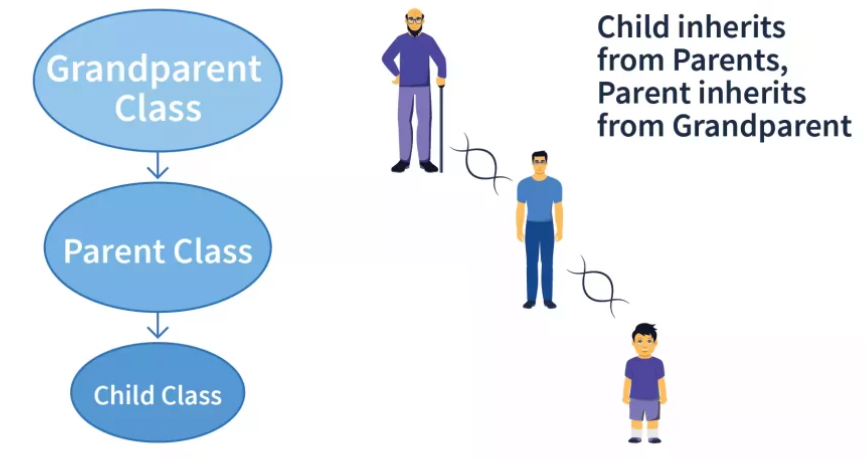

# Inheritance 

    Inheritance is a mechanism in object-oriented programming (OOP) where a class derives properties and behaviors (methods) from another class. It helps achieve code reusability and establish a relationship between parent and child classes.


## 1. Single Inheritance
Single inheritance occurs when a class inherits from only one parent class. The subclass has access to all the attributes and methods of the parent class.

> **Key Point** : One Parent - One Child


*Single Inheritance [credits:scaler topics]*

Implementation can be found in `singleInheritance.py`

## 2. Multiple Inheritance

In multiple inheritance, a class inherits from more than one parent class. This allows the child class to access methods and attributes from multiple parent classes. During accessing the methods, the interpreter first searches the child class for the method if not found then it searches the parant class via depth-first search 

> **Key Point**: Multiple Parent - One Child


*Multiple Inheritance [credits:scaler topics]*

### Method Resolution Order (MRO)
When using multiple inheritance, Python uses a Method Resolution Order (MRO) to determine the order in which methods are called. Python uses the C3 linearization algorithm to resolve this order, which ensures a consistent method lookup from the base classes.

The MRO can be understood from below:

```python

class A:
    def method(self):
        print("Method in class A")

class B(A):
    def method(self):
        print("Method in class B")

class C(A):
    def method(self):
        print("Method in class C")

class D(B, C):
    pass

d = D()
d.method() # Returns the output as : Method in class B

```
The output of the above code is so because the object `d` is of class **`'D'`** which is a child class of **`'B'`** and **`'C'`**. It can be noticed that the class **`'B'`** is first passed into class **`'D'`**. So the interpreter searchers for the `method` in class **`'B'`** first, thus the output.

Implementation can be found in `multipleInheritance.py`

## Multi-level Inheritance

In multi-level inheritance, a class inherits from another class, and that class also inherits from another class. This creates a chain of inheritance, where the child class can access methods from its direct parent, and also from its grandparent class.

>**Key Point**: Grand parent - parent - child


*Mult-level Inheritance [credits:scaler topics]*

Implementation can be found in `multilevelInheritance.py`

## Hybrid Inheritace

Hybrid inheritance is a combination of more than one type of inheritance. It can involve multiple inheritance, multi-level inheritance, or both. This can create complex class hierarchies and should be used carefully to avoid ambiguity.

>**Key Points**: Combination of multiple inheritance


*Hybrid Inheritance [credits:scaler topics]*

Implementation can be found in `hybridInheritance.py`