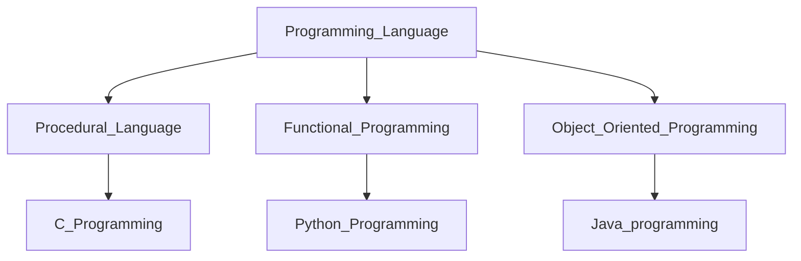
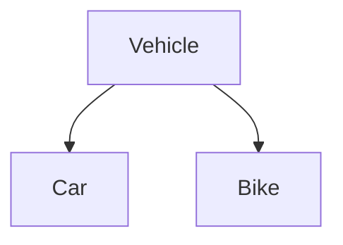
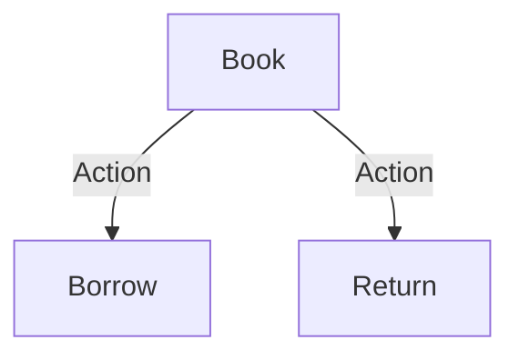
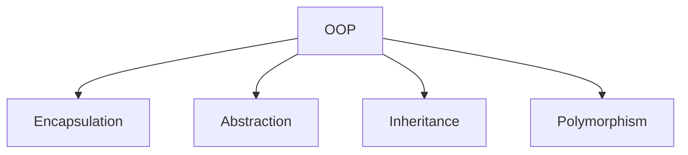
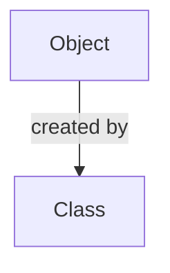
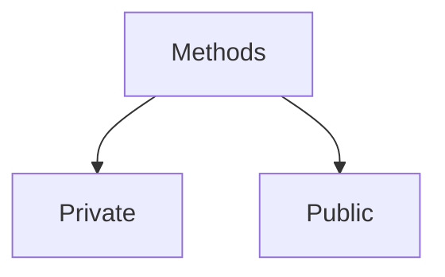

# Object-Oriented Programming (OOP)

Python, though states as a functional Programming language. It contains the properties of Object-Oriented programming. 

**The programming language can be divided into 3 parts**

## Overview of Object-Oriented Programming (OOP)
Object-Oriented Programming is a paradigm based on the concept of "objects," which contain data and methods. It allows developers to model real-world scenarios efficiently by organizing code into reusable, self-contained units.

## Real-World Examples of OOP Concepts

### Example 1: Vehicle System
- **Class**: Vehicle
- **Inheritance**: Car and Bike classes inherit from Vehicle.

### Example 2: Library Management System
- **Class**: Book
- **Objects**: Physical books in a library.
- **Methods**: Borrow(), Return().

### Key Features of OOP
- **Encapsulation**: Wrapping data (variables) and methods (functions) into a single unit (class).
- **Abstraction**: Hiding implementation details and exposing only the essential features.
- **Inheritance**: Enabling new classes to inherit properties and behaviors from existing classes.
- **Polymorphism**: Allowing methods to perform differently based on the object that calls them.

## Core Components of OOP

### 1. Classes and Objects
- **Class**: Blueprint for creating objects. Defines properties and methods.
- **Object**: Instance of a class.

### 2. Methods of Objects
- **Private Methods**: Accessible only within the class.
- **Public Methods**: Accessible from outside the class.

# Private Methods
    In Python, private methods are typically defined by convention, as there is no strict enforcement of access control like in some other languages. Private methods are meant to be used only within the class they are defined in, and they are usually prefixed with an underscore (_) to indicate that they are intended for internal use. A double underscore (__) can be used for name mangling, which changes the method name to include the class name, making it harder (but not impossible) to access from outside the class. This is more of a safeguard than a strict access restriction. Refer to Object_methods.py

1. Name Mangling:
    It is the process of naming a identifier using the prefix "__" (double underscore), which makes the variable accessable only by using the class name prefixed with "_" (single underscore) followed by the indentifier name with double indentifier

2. Syntax of Private Methods with name mangling
    > Object._ClassName__privateMethod()

# Public Methods

    These are normal methods that without any name mangling. Refer to Object_methods.py

## Difference between Private and Public Methods

| Scope   | Within Class | Within Sub-class | Outside Class and Sub-class |
| ------- | ------------ | ---------------- | --------------------------- |
| Public  | Yes          | Yes              | Yes                         |
| Private | Yes          | No               | No                          |

## Benefits of OOP
1. Modular structure for easy troubleshooting.
2. Code reuse through inheritance.
3. Enhanced software maintainability.
4. Flexibility through polymorphism.

## Frequently Asked Questions

### What is the difference between a class and an object?
- **Class**: A blueprint or prototype.
- **Object**: An instance of a class.

### Why is encapsulation important?
Encapsulation protects the data from unintended interference and misuse by bundling it with code that operates on it.

### How does inheritance enhance code reuse?
Inheritance allows a new class to use the methods and properties of an existing class, reducing redundancy.

---

This document provides an overview and key concepts of OOP, illustrated with visual graphs created using Mermaid.

